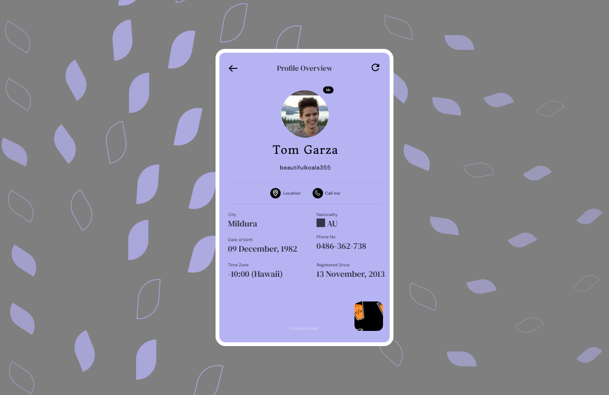

# 🐱🐦 Random Profiles, Jokes, and Cats - React Assignment

## Overview

This project is a React-based application developed to fulfill the requirements of an assignment in [ChaiAurCode](https://chaicode.com) coding community. The app showcases three main features:

1. **Random User Profile**
2. **Random Jokes Tweet**
3. **Cats Listing**

Each feature is built with precise adherence to the provided Figma designs and integrates data from [FreeAPI.app](https://freeapi.app). The app is structured with separate routes for each feature, ensuring a smooth user experience.

## 🎯 Assignment Tasks

### 1. Random User Profile

- **Route**: `/random-user`
- **Styling**: The component matches the provided Figma design.
- **Functionality**:
  - A refresh button fetches the next set of random user data.
  - A creative loading state is displayed while data is fetched.
  - Mapped API response fields align with the Figma design.
  - The location and call fields are hyperlinked to open in a new tab.
- **API**: `https://api.freeapi.app/api/v1/public/randomusers/user/random`

### 2. Random Jokes Tweet

- **Route**: `/random-jokes`
- **Styling**: Matches the Figma design.
- **Functionality**:
  - Tweet author details are static (e.g., Elon Musk).
  - Timestamp, views, date, and analytics are randomly generated.
  - A creative loading state is displayed while data is fetched.
  - New joke data replaces the tweet content on page reload.
- **API**: `https://api.freeapi.app/api/v1/public/randomjokes/joke/random`

### 3. Cats Listing

- **Route**: `/cats-listing`
- **Styling**: Matches the Figma design.
- **Functionality**:
  - Displays a paginated list of horizontal scrolling cards with cat information.
  - A creative loading state is displayed while data is fetched.
  - Pagination and limit are configured to list all cats from the database.
- **API**: `https://api.freeapi.app/api/v1/public/cats?page=1&limit=4`

## 🚀 Getting Started

### Prerequisites

- Node.js
- npm or yarn

### Installation

1. **Clone the repository**:

   ```bash
   git clone https://github.com/your-username/random-profiles-jokes-cats.git
   cd random-profiles-jokes-cats
   ```

2. **Install dependencies**:

   ```bash
   npm install
   # or
   yarn install
   ```

3. **Run the application**:

   ```bash
   npm start
   # or
   yarn start
   ```

4. **Visit the app in your browser**:
   - Base URL: `http://localhost:3000/`
   - Random User Profile: `http://localhost:3000/random-user`
   - Random Jokes Tweet: `http://localhost:3000/random-jokes`
   - Cats Listing: `http://localhost:3000/cats-listing`

## 📸 Screenshots

### FIGMA LINK

[MasterJi-Assignment-2-(React.js)](<https://www.figma.com/design/lZnq8DrxXMN6hdRIUHjKdc/MasterJi-Assignment-2-(React.js)?node-id=0-1&t=VNbsshdPocye2yJl-1>)

### Random User Profile



### Random Jokes Tweet


### Cats Listing


## 🌐 Deployment

The application is deployed at: [Your Deployed Site Link](#)

## 📚 Documentation

- **Figma Design**: [Link to Figma](#)
- **FreeAPI Documentation**: [FreeAPI.app](https://freeapi.app)

## 🔗 Links

- **ChaiCode**: [chaicode.com](https://chaicode.com)

## 👩‍💻 Author

- **AbhiImReal403**: [Your GitHub Profile](https://github.com/AbhiImReal403)

## 📝 License

This project is licensed under the MIT License - see the [LICENSE](LICENSE) file for details.

## 🔍 Peer Review Instructions

- **Submission Deadline**: 16 August, 8:30 PM IST
- **Peer Review Deadline**: 18 August, 11:30 PM IST

## 🧪 Secret Route: `/gods-mode`

There's a hidden gem in this project called **God's Mode**. This route was built as a sandbox for experimenting with UI enhancements beyond the original assignment requirements. It's a showcase of some creative ideas that were tried out during the development process.

- **Access it at**: `/gods-mode`
- **Features**:
  - **Dropdown Navigation**: At the bottom of the page, you'll find a dropdown button that allows you to navigate to the other routes in the project without needing to type them out manually.

Feel free to explore this route to see some of the additional UI concepts and ideas that were experimented with!
