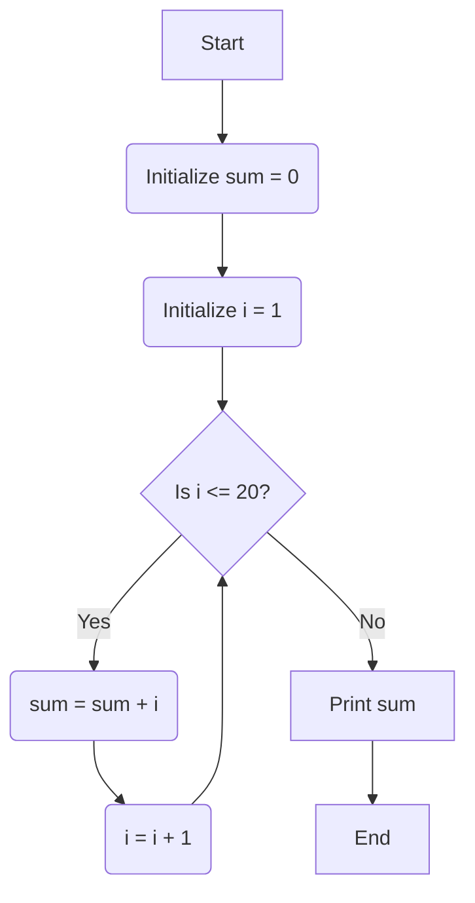

Here are the answers for the BCS-011-Jun-2024 question paper, drawing on the provided sources:

---

**1. (a) Explain the role of RAM in a computer system. Most of the computer system has very large capacity hard disk, why such a computer need RAM ? Explain.**

**Role of RAM:**
RAM (Random Access Memory) is a **read and write memory (R/W memory)** in a computer system. It is called **random access** because any memory location can be accessed in a random manner for reading and writing, and the **access time is the same for each memory location**. RAM usually refers to **"temporary" memory**, meaning that **when the system is shut down, the memory is lost** (it is volatile).

The main memory, which includes RAM, holds the **programs and data required by the CPU for carrying out its operations**. When the CPU runs a program, it **fetches the program instructions from the RAM and carries them out**. Similarly, if the CPU needs to store the final results of calculations, it stores them in RAM. Thus, the CPU can both **READ data from RAM and WRITE data into the RAM**.

**Why RAM is needed even with a large hard disk:**
A computer system can have a very large capacity hard disk, but it still requires RAM because **hard disks are secondary storage devices**, and **secondary memory cannot be accessed directly by the CPU**. For information from secondary memory to be processed by the CPU, it must first be **transferred to the main memory (RAM)**. The **CPU is an extremely fast device** compared to the main memory, and it cannot work on its own; it **depends on the main memory to send data and instructions when required for processing**.

If the CPU had to constantly access the hard drive to retrieve every piece of data it requires, the operation would be **very slow**. Data needs to be fed to the CPU with the same speed as its processing speed. Therefore, data is **first stored in the storage unit (primary storage like RAM) for faster access and processing**. This provides space for storing data and instructions, and intermediate results of processing. RAM has a significantly **faster access time** (about 50-70 ns) compared to mass storage devices like hard disks (measured in milliseconds). To reduce the idle time of the CPU and increase processing speed, a fast memory like RAM is essential.

---

**1. (b) Which I/O devices would be needed to perform each of the following tasks ? Also, list the characteristics of the I/O devices, identified for tasks given below :**

Input/output (I/O) devices are peripheral devices that allow a user to communicate with the computer, entering data and instructions, and receiving results.

**(i) A device to cause movement of pointer on a screen and selection of pointed information.**
*   **Device:** **Mouse**.
*   **Characteristics:**
    *   A mouse is a **handy device** that can be moved on a smooth surface to cause the **movement of a cursor on the screen**.
    *   It is a **pointing device** used to input data and information into the computer system by pointing on it.
    *   Physically, a mouse contains a small case, held under one of the user’s hands with **one or more buttons**.
    *   For **GUI-based systems**, a mouse is an essential pointing device.
    *   The cursor of the mouse moves in the **same direction in which the mouse ball rolls** (for mechanical mice).
    *   **Optical mice** use Laser rays for cursor movement, detecting changes in reflected light.
    *   **Wireless mice** transmit data through infrared or radio signals, providing user freedom without a physical connection.

**(ii) A device that can help in input of pictures.**
*   **Device:** **Scanner** or **Digital Camera**.
*   **Characteristics of Scanner:**
    *   A scanner is an **input device** used to input data into the computer system in the **form of pictures**.
    *   It **optically scans images, printed text, handwriting, or an object**, and converts it to a digital image.
    *   Examples include desktop or flatbed scanners, where the document is placed on a glass window for scanning.
    *   **Planetary scanners** photograph books and documents, and **three-dimensional scanners** produce 3D models of objects.
*   **Characteristics of Digital Camera:**
    *   A digital camera is an electronic device that takes **video or still photographs (or both) digitally** by recording images via an electronic image sensor.
    *   They can display images on screen immediately and store images on **memory cards with flash memory**.
    *   Most digital cameras allow users to **choose the resolution**.
    *   They can **connect directly to a computer** to transfer data, including via **wireless connections** like Bluetooth.
    *   **JPEG** is the most common file format for storing data in a camera.

---

**1. (c) Perform the following conversions :**

**(i) Convert (2.125)10 to equivalent binary.**
*   **Integer Part (2):**
    *   2 / 2 = 1 remainder 0
    *   1 / 2 = 0 remainder 1
    *   Reading remainders from bottom up: **10**
*   **Fractional Part (0.125):**
    *   0.125 * 2 = 0.250 (integer part 0)
    *   0.250 * 2 = 0.500 (integer part 0)
    *   0.500 * 2 = 1.000 (integer part 1)
    *   Reading integer parts from top down: **.001**
*   **Equivalent Binary:** (2.125)10 = **(10.001)2**

**(ii) Convert (1100 0011)2 to equivalent hexadecimal and decimal.**
*   **To Hexadecimal:** Group binary digits in sets of 4 from right to left, adding leading zeros if needed, then convert each group to its hexadecimal equivalent.
    *   (1100)2 = C (in hexadecimal)
    *   (0011)2 = 3 (in hexadecimal)
    *   Equivalent Hexadecimal: (1100 0011)2 = **(C3)16**
*   **To Decimal:** Multiply each binary digit by its corresponding power of 2 and sum the results.
    *   1 * 2^7 + 1 * 2^6 + 0 * 2^5 + 0 * 2^4 + 0 * 2^3 + 0 * 2^2 + 1 * 2^1 + 1 * 2^0
    *   = 1 * 128 + 1 * 64 + 0 * 32 + 0 * 16 + 0 * 8 + 0 * 4 + 1 * 2 + 1 * 1
    *   = 128 + 64 + 0 + 0 + 0 + 0 + 2 + 1
    *   = **195**
    *   Equivalent Decimal: (1100 0011)2 = **(195)10**

---

**1. (d) “A program written in high-level programming language is to be converted into object code.” Which software would be required for the task as given above ? Explain the characteristics of that software.**

The software required for converting a program written in a high-level programming language into object code is a **Compiler**.

**Characteristics of a Compiler:**
*   A compiler is a program that **translates the code written in a high-level programming language (called the source code) to the code in a lower-level language (the object code)**.
*   Generally, the **object code is the machine language code**.
*   The compiler translates **each source code instruction into a set of object code instructions**.
*   When a compiler compiles a program, the source program **does not get executed during the process**; it only gets converted to a form that can be executed by the computer.
*   **Any errors are reported at compile time for the complete code**.
*   Once the translation is complete, **only the executable version of the code runs in the memory**, and the compiler is not needed at run time.
*   Compiled programs generally **run faster** than interpreted ones because the entire program is translated before execution.
*   High-level programming languages, which compilers process, provide good readability, portability, and ease of software development.

---

**1. (e) Draw a flow chart to add all numbers from 1 to 20. Explain the logic of your flow chart with suitable algorithm.**

**Algorithm to add all numbers from 1 to 20:**

**Step 1:** **Start**
**Step 2:** Initialize a variable `sum` to 0. (This variable will store the cumulative sum)
**Step 3:** Initialize a counter variable `i` to 1. (This variable will iterate from 1 to 20)
**Step 4:** **Loop**: While `i` is less than or equal to 20, repeat steps 5 and 6.
**Step 5:** Add the current value of `i` to `sum`. So, `sum = sum + i`.
**Step 6:** Increment `i` by 1. So, `i = i + 1`.
**Step 7:** **End Loop**.
**Step 8:** Print the final value of `sum`.
**Step 9:** **End**

**Flowchart to add all numbers from 1 to 20:**



**Logic of the Flowchart and Algorithm:**
The algorithm and flowchart use a **repetition (looping) control structure**.
1.  **Initialization:** The `sum` variable is set to 0 to ensure that we start with a clean sum. The `i` variable is set to 1 as we want to start adding numbers from 1.
2.  **Loop Condition:** The core logic is within the "Is i <= 20?" decision box (Step 4). This acts as the **control statement** for the loop. As long as `i` is less than or equal to 20, the loop continues.
3.  **Loop Body:** Inside the loop (Steps 5 and 6), two operations occur:
    *   **Summation (`sum = sum + i`):** The current value of `i` (which represents a number from 1 to 20 in each iteration) is added to the `sum` variable. This is an **arithmetic operation**.
    *   **Increment (`i = i + 1`):** The counter `i` is incremented by 1. This ensures that in the next iteration, the next number in the sequence (e.g., 2, then 3, and so on) is added to the sum, and eventually, the loop condition `i <= 20` will become false, terminating the loop.
4.  **Termination:** Once `i` becomes 21, the condition `i <= 20` becomes false, and the flow moves out of the loop to print the final `sum`. This ensures all numbers from 1 to 20 have been added.

This sequential execution with a controlled repetition allows the program to efficiently sum a range of numbers without writing 20 individual addition statements.

---

**1. (f) What are the uses of database management systems ? List any three functions of MS-Access.**

**Uses of Database Management Systems (DBMS):**
A Database Management System (DBMS) is used to **store, maintain, manipulate, and organize a large set of data**. Its core function is to organize information into data in the form of **tables**, and different tables can be joined together based on **relationships**. This relational structure helps in **reduction of repetitive data, improves accuracy, and provides better management of data**.

Specific uses include:
*   Maintaining address books, phone number directories, or client directories.
*   Managing large student data in a university, including maintaining, manipulating, and organizing student records.
*   Used for various data processing tasks, such as sorting lists, searching for specific records, preparing and formatting documents, and accounting jobs.

**Three Functions of MS-Access:**
MS-Access is a commonly used database software. Its functions allow users to manage databases effectively:
1.  **Table Creation and Management:** MS-Access allows users to **create tables** to store data about particular subjects (e.g., employees, students, products). Users can **define fields (columns)**, specify their **data types** (e.g., text, numbers), and **add data (rows/records)** to these tables. It also supports setting a **Primary Key** to ensure unique records and reduce duplicate data.
2.  **Defining Relationships:** MS-Access enables users to **define relationships between different tables** based on common fields. This is crucial for a relational database, allowing data from multiple tables to be linked and retrieved coherently. It can also **enforce referential integrity** to prevent orphaned records and maintain data consistency.
3.  **Defining Queries:** Users can **create and run queries** to review, add, change, or delete data from the database. Queries are powerful tools to **answer specific questions about the data**, **perform calculations**, **filter data**, and **summarize information**. Results of queries can be displayed in a grid format.

---

**1. (g) Differentiate between the following :**

**(i) Twisted pair cable and Optical fiber**

| Feature             | Twisted Pair Cable                                   | Optical Fiber Cable           |
| :------------------ | :--------------------------------------------------------- | :------------------------------------------------------- |
| **Physical Structure** | Pairs of insulated copper wires twisted together.         | Two concentric cylinders (inner core, outer cladding) made of transparent plastic or glass. |
| **Signal Type**     | Electrical signals.                                        | Light signals.                                           |
| **Transmission**    | Transmits electrical signals over copper wires.            | Guides light through a channel using reflections.        |
| **Bandwidth/Speed** | Relatively lower bandwidth (e.g., 100s of Mbps). Performance can degrade over distance. | **Much higher bandwidth** (e.g., 100s of MHz per kilometer, up to Gbps and beyond). |
| **Signal Attenuation** | Higher signal attenuation, limiting transmission distance. | **Less signal attenuation**, can run for 50Kms without regeneration. |
| **Noise Immunity**  | Susceptible to **electromagnetic interference (crosstalk and thermal noise)**. Can be improved with shielding. | **Immune to electromagnetic interference** as it uses light. |
| **Cost**            | Generally **less expensive** to install and maintain.    | Relatively **more expensive** for cables and interfaces. |
| **Installation**    | Easier to install and maintain.                            | Needs specialized expertise for installation and maintenance. |
| **Weight**          | Heavier than optical fiber cables.                         | **Much lighter** than copper cables.                     |
| **Security**        | Less immune to tapping.                                    | **More immune to tapping** than copper cables.           |
| **Directionality**  | Bidirectional.                                             | **Unidirectional** (needs two fibers for bidirectional communication). |
| **Primary Use**     | Used for telephone networks, Ethernet LANs (e.g., 10BaseT, 100BaseT). | Used as telecommunication carriers for long-distance digital trunk lines, replacing twisted pair residential loops. |

**(ii) Radio waves and Microwaves**

| Feature            | Radio Waves                               | Microwaves                         |
| :----------------- | :-------------------------------------------------------------- | :------------------------------------------------------- |
| **Frequency Range**| Generally **lower frequencies** (e.g., VHF, UHF bands, 2400-2480 MHz for Bluetooth). | **Higher frequencies** (1 to 300 Gigahertz).            |
| **Propagation**    | Propagate in **all directions** from the source (Omni-directional). Transmitter and receiver do not need careful physical alignment. | **Travel in straight lines (line-of-sight)**. Requires focused beams between transmitter and receiver. |
| **Antenna Type**   | Non-directional antennas.                                       | Highly directional parabolic (dish) antennas.            |
| **Penetration**    | Can penetrate walls and obstacles.                              | **Cannot penetrate obstacles (buildings, hills)**; requires clear line of sight. |
| **Applications**   | Long-distance communication over difficult terrain, cellular radio, mobile telephone networks, cordless phones, paging, Bluetooth. | Long-distance telephone communication, television distribution, satellite communication, highly focused point-to-point links. |
| **Bandwidth**      | Varies, but generally lower than microwaves for point-to-point. | **High bandwidth**, subdivided into channels of 10s of MHz, providing data rates in order of 100s of Mbps. |
| **Usage Area**     | Wider area coverage.                                            | Best suited for **point-to-point communication** where line of sight is possible. |
| **Terrestrial vs. Satellite** | Primarily terrestrial, but used in some satellite applications. | Both terrestrial (line-of-sight) and satellite communication. |

**(iii) Ring topology and Star topology**

| Feature           | Ring Topology                       | Star Topology                       |
| :---------------- | :------------------------------------------------------------- | :-------------------------------------------------------- |
| **Structure**     | Nodes connected in a **circular loop**; each node connects to exactly two neighbors. No terminators needed. | Each computer connects to a **central hub/concentrator**. |
| **Data Flow**     | Data travels in **one direction** from node to node around the ring. | All communication goes through the central hub.           |
| **Network Type**  | **Active network** (each computer retransmits what it receives). | Passive (hub simply re-sends messages).                   |
| **Performance under Load** | Performs **better under heavy network load** than star topology. | Performance degrades significantly under heavy load as all traffic passes through the central hub. |
| **Reliability**   | **One malfunctioning node or bad port can affect the entire network** (e.g., breaking the ring). | **More reliable**; if one connection fails, it does not affect others. The central hub can detect and isolate faults. |
| **Installation/Modification** | Difficult to troubleshoot. Adding/removing nodes can disrupt the network. | **Easy to replace, install, or remove devices** without disturbing the rest of the network. Easier to diagnose faults. |
| **Cabling Cost**  | Requires short cable segments; specific adapter cards/MAUs are more expensive. | **More expensive to install** due to more cabling (all cables go to a central point). |
| **Network Management** | Does not require a network server to manage connectivity. | Requires a central hub, which adds to hardware cost and a single point of failure if the hub fails. |
| **Examples**      | IBM Token Ring, Fiber Distributed Data Interface (FDDI).         | Common in modern Ethernet LANs.                          |

**(iv) Collaboration networking and Social networking**

| Feature            | Collaboration Networking                                                                                                               | Social Networking                                                                                                                              |
| :----------------- | :----------------------------------------------------------------------------------------------------------------------------------------------------------------- | :---------------------------------------------------------------------------------------------------------------------------------------------------------------------- |
| **Primary Goal**   | To **enable groups of people to work together on a common project or task**, often geographically dispersed, to achieve a shared objective.                     | To **build and maintain social connections** between individuals based on shared interests, friendships, kinship, or common causes.                                           |
| **Focus**          | **Task-oriented and goal-driven**. Focus on collective creation, problem-solving, and achieving defined outcomes (e.g., research papers, software development). | **Relationship-oriented and communication-focused**. Emphasis on sharing personal updates, photos, general information, and interacting socially.                           |
| **Tools/Platforms**| Tools like **Google Docs**, Microsoft Office collaborative features, specific project management software, BOINC (volunteer computing platforms), wikis (e.g., Vedyadhara for educational content development). | Websites and applications like **Orkut, Facebook, Twitter, LinkedIn, MySpace, Yahoo! 360**.                                                                                     |
| **Content**        | Often involves **shared documents, spreadsheets, presentations, code, research data**, and discussion forums directly related to the project.                       | Primarily involves **personal profiles, status updates, photos, videos, general interest posts**, and direct messaging between individuals or groups.                       |
| **Output**         | A **jointly produced artifact** (e.g., a research paper, a developed software module, a compiled document).                                                      | **Maintaining connections, sharing experiences, building communities**, and disseminating personal or general information.                                                        |
| **Privacy/Security** | Data confidentiality and access control are critical due to project sensitivity.                                                                                  | Information shared can be broad; users are advised to be cautious about confidential information due to potential misuse.                                       |
| **Examples**       | Co-authoring research papers, distributed software development, high-energy physics collaborations, health sciences data sharing, environmental studies.             | Connecting with friends, family, former classmates, finding people with similar hobbies, political activism, news dissemination.                                              |

---

**2. (a) What is a CPU in a computer ? What are its components ? Explain the role of each component of the CPU.**

**What is a CPU?**
The **Central Processing Unit (CPU)** is considered the **brain of any computer system**. It is a complex **semiconductor integrated circuit chip** consisting of millions of transistors. Its fundamental operation is to **execute a series of instructions called a program**. The CPU takes all major decisions, performs all sorts of calculations, and directs different parts of the computer's functions by activating and controlling operations. In personal computers, the CPU is also referred to as the **Microprocessor**.

**Components of a CPU:**
A CPU has three major identifiable parts:
1.  **Arithmetic & Logic Unit (ALU)**
2.  **Control Unit (CU)**
3.  **A set of Registers**

**Role of each component of the CPU:**

1.  **Arithmetic & Logic Unit (ALU):**
    *   The ALU is an **important component of the CPU that carries out the actual execution of instructions**.
    *   It is responsible for performing **arithmetic operations** (like addition, subtraction, multiplication, division) and **logical operations** (like comparisons).
    *   Data is transferred to the ALU from the storage unit when required, and after processing, the output is returned to the storage unit.
    *   The ALU has logic implemented to perform these operations on represented numbers, both integer and floating-point.

2.  **Control Unit (CU):**
    *   The Control Unit acts like a **supervisor**, ensuring that tasks are performed in the proper fashion.
    *   It **determines the sequence in which computer programs and instructions are executed**.
    *   Its roles include processing programs stored in main memory, interpreting instructions, and issuing signals for other units of the computer to execute them.
    *   It also **coordinates the activities of computer's peripheral equipment** as they perform input and output.
    *   The CU is responsible for **overall control and coordination of instruction execution**. It generates timing signals and initiates the Fetch cycle of instruction execution. When an instruction is fetched, it generates the sequence of micro-operations needed for its execution.

3.  **Registers:**
    *   Registers are a **small set of high-speed memory locations internal to the processor**.
    *   They are used to **store some data temporarily**. Registers lie above Cache and Main memory in the memory hierarchy, meaning they are the fastest memory components.
    *   They perform two roles:
        *   **User-visible registers:** Used to store temporary data items and other user-accessible information useful for machine or assembly language programmers.
        *   **Control & Status Registers:** Used by the Control Unit to control and coordinate CPU operations. Accumulator is one such register frequently used during ALU operations.

---

**2. (b) What would be the storage capacity of a 2 inch diameter disk pack having 8 plates, with 2048 tracks on a surface. Each track has 512 sectors and each sector can store 1 kB data.**

To calculate the storage capacity of a disk pack, the following formula is used:
**Storage capacity = (m * t * p * s) bytes**
Where:
*   `m` = total number of recording surfaces
*   `t` = tracks per surface
*   `p` = sectors per track
*   `s` = bytes per sector

Given values:
*   Number of plates = 8
*   Tracks per surface (`t`) = 2048
*   Sectors per track (`p`) = 512
*   Data per sector (`s`) = 1 kB = 1024 bytes (since 1 KB = 1024 bytes)

First, calculate the total number of recording surfaces (`m`):
A disk pack typically has two recording surfaces per plate (one on top, one on bottom), unless specified otherwise.
So, `m` = Number of plates * 2 = 8 * 2 = 16 recording surfaces.

Now, substitute the values into the formula:
Storage Capacity = 16 * 2048 * 512 * 1024 bytes
Storage Capacity = 16 * 2048 * 512 * 1024
Storage Capacity = 17,179,869,184 bytes

To convert to GB (Gigabytes), divide by (1024 * 1024 * 1024):
Storage Capacity = 17,179,869,184 / (1024 * 1024 * 1024) GB
Storage Capacity = 17,179,869,184 / 1,073,741,824 GB
Storage Capacity = **16 GB**

The storage capacity of the disk pack would be **17,179,869,184 bytes** or **16 GB**.

---

**2. (c) Explain the term access time in the context of a hard disk with the help of an example.**

**Access Time in Hard Disk Context:**
Access time refers to the **total time required to locate and retrieve stored data from a storage unit** in response to a program instruction. For a magnetic disk like a hard disk, accessing information involves several mechanical movements, which contribute to the overall access time.

The total access time for a hard disk is the sum of two main components:
**Access Time = Seek Time + Latency Time**

1.  **Seek Time (Ts):**
    *   This is the time required to **position the read/write head over the proper track (or cylinder)** where the desired data is located.
    *   The read/write heads are first moved onto the specified track by moving the arm assembly.
    *   Seek time **varies depending on the current position of the arm assembly** and the target track. It's maximum if the head needs to move from the outermost track to the innermost, and zero if it's already on the desired track.
    *   **Average seek time** is generally specified for most systems, typically ranging from a few milliseconds to fractions of a second (e.g., 10 to 15 milliseconds).
    *   For fixed-head systems, seek time is always 0 as there's a head for each track, eliminating movement.

2.  **Latency Time (tL) or Search Time:**
    *   Once the read/write head is positioned on the correct track, the disk is continuously rotating. Latency time is the **rotational waiting time**, i.e., the **time required to bring the needed data (the starting position of the addressed sector) under the read/write head**.
    *   Latency time also **varies**, depending on the distance of the desired data from the initial head position on the track and the rotational speed of the disk.
    *   It is generally averaged for practical purposes.

**Example:**
Imagine you have a file stored on a hard disk. When the operating system needs to read a specific part of this file:
1.  **Seek Time:** The hard disk's read/write arm will first **move across the platters** to position the read/write head precisely over the **correct circular track** where the data block resides. If the data is on Track 500 and the head is currently on Track 100, it needs to "seek" 400 tracks. This movement takes a certain amount of time, say **8 milliseconds**.
2.  **Latency Time:** Once on Track 500, the head has to **wait for the exact sector** containing the data to rotate underneath it. If the disk spins at 7200 RPM, it completes 120 rotations per second. On average, the head would have to wait half a rotation for the sector to appear. This waiting time might be, for instance, **4 milliseconds**.

Therefore, the **total access time** to retrieve that specific data block would be 8 ms (seek time) + 4 ms (latency time) = **12 milliseconds**. This combined time is how long it takes for the drive to get to the data before it can start reading or writing.

---

**2. (d) Explain the following utility software of a computer :**

Utility software programs **help manage, maintain, and control computer resources**. They are designed to assist with day-to-day computing tasks and keep the system running at peak performance.

**(i) Disk checker:**
*   **Purpose:** Disk checkers are used to **check the integrity of the hard disk and Pen Drive/Flash Drive**. They are designed to **fix logical file system errors** found in the disk/drive.
*   **Example:** **CHKDSK** is a command-line tool available on Windows operating systems for this purpose.
*   **Functionality:** It can run in read-only mode to simply report errors, or it can be set to automatically fix file system errors (without scanning for bad sectors) or to repair errors, locate bad sectors, and attempt recovery of readable information.

**(ii) System restore:**
*   **Purpose:** System restore is a utility that helps to **undo changes to the computer and restores its settings and performance** to an earlier state. It is particularly useful in case of system malfunction or failure.
*   **Functionality:** It backs up system files (such as .dll, .exe files) and registry keys, saving them for later use. It creates "restore points" at various times, allowing the user to roll back the system to a previous healthy configuration.
*   **Limitation:** It is important to note that system restore is **not able to take backups of personal files** such as images, e-mails, or documents.

**(iii) Disk defragmenter:**
*   **Purpose:** Disk defragmenter is a utility software that helps **improve the performance of the system by reorganizing fragmented data** on a disk. Fragmentation occurs when parts of files are stored in non-contiguous locations on the hard disk.
*   **Functionality:** It reorganizes fragmented files so they are stored in **contiguous locations**, which **speeds up reading and writing to the disks**.
*   **Maintenance:** Users should run a defragmenter at regular intervals to keep the computer running quickly and efficiently.

---

**3. (a) What is an Operating System ? Explain various services offered by an operating system.**

**What is an Operating System (OS)?**
An Operating System (OS) is **system software** that acts as an **interface between the user of a computer and the computer hardware**. It can be viewed as an **organized collection of software** consisting of procedures for operating a computer and providing an environment for program execution. The basic objectives of an operating system are to **make the computer system convenient to use and to utilize computer hardware in an efficient manner**. It manages all the **resources of the computer system**, such as memory, processor, file system, and input/output devices, keeping track of their status and deciding who controls them, for how long, and when. Without an operating system, a computer is of no use.

**Various Services Offered by an Operating System:**
Operating systems provide a range of services to users and programs to enable efficient and convenient computer usage. These include:

1.  **Command Processor and User Interface (Shell):**
    *   The OS provides interfaces for the user (e.g., keyboard, mouse clicks) and for user programs.
    *   It accepts commands from a user and interprets these commands to take actions.
    *   Common user interfaces include **Graphical User Interface (GUI)**, which relies on menus, mouse movements, and clicks, and **Command Line Interface (CLI)**, which relies on typed commands.
    *   This interface allows users to get work done more quickly and efficiently, combining simplicity with powerful access to computer facilities.

2.  **File Management:**
    *   The OS provides a **file system support to manage huge volumes of data** on secondary storage devices.
    *   A file is a collection of related information, treated as a logical unit of storage.
    *   The file management system provides and maintains the **mapping between a file's logical storage needs and its physical location**. Users and programs access files by name, and the system handles the details of allocating space, storing, and retrieving files.
    *   It ensures **no duplicate use of physical storage** and keeps track of available space on devices.

3.  **Input/Output (I/O) Services:**
    *   Every operating system provides I/O services for each device in the system.
    *   It includes **I/O device driver programs** for each installed device.
    *   These drivers accept I/O requests and **perform the actual data transfers between hardware and specified memory areas**.
    *   Modern OS like Windows support **"plug-and-play"**, integrating drivers for newly installed devices seamlessly.

4.  **Process Control Management:**
    *   A **process is an executing program** and is considered the standard unit of work.
    *   The OS manages processes by determining which jobs are admitted and in what order (**job scheduling**).
    *   It ensures that multiple processes sharing resources do not interfere with each other (e.g., altering critical data).
    *   For multitasking, the OS allocates CPU time equitably to each program.
    *   Many modern systems break processes into smaller units called **threads**, which are individually executable parts of a process that share resources but can be scheduled separately.

5.  **Memory Management:**
    *   The purpose of memory management is to **load programs into memory efficiently**, ensuring each program gets the memory it requires for execution.
    *   It keeps track of **which parts of memory are currently in use** by which process and also available space.
    *   It maintains queues of programs waiting to be loaded, based on criteria like priority and memory requirements.
    *   When space is available, it **allocates memory to programs** and **de-allocates memory when a program completes execution**, making that space available for others.

---

**3. (b) Explain the following with the help of an example for each :**

**(i) Data types:**
*   **Explanation:** A data type is a **classification identifying the type of data** that a variable can hold. It determines the possible values for that type, the operations that can be performed on those values, and how they are stored in memory. Programming languages categorize data into types like integers, floating-point numbers, characters, and sequences of characters (strings).
*   **Example (in C programming language context):**
    ```c
    int age;         // 'int' is a data type for whole numbers (integers).
                     // 'age' variable can store values like 25, 30.
    float price;     // 'float' is a data type for numbers with decimal points.
                     // 'price' variable can store values like 19.99, 100.50.
    char initial;    // 'char' is a data type for single characters.
                     // 'initial' variable can store 'J', 'S'.
    char name;   // 'char name' is for a string (sequence of characters).
                     // 'name' can store "Alice", "Bob".
    ```
    In this example, `int`, `float`, and `char` are data types.

**(ii) One-dimensional arrays:**
*   **Explanation:** An array is a **set of elements of the same data type** that can be individually referenced by an index (or subscript value). A **one-dimensional array** is a structured collection where elements are accessed by specifying a single position (index). These elements are usually placed in contiguous memory locations.
*   **Example (in C programming language context):**
    Suppose you want to store the marks of 5 students. Instead of using 5 different variables like `mark1`, `mark2`, etc., you can use a one-dimensional array:
    ```c
    int marks; // Declares an array named 'marks' that can store 5 integer values.
                  // The elements are accessed using indices from 0 to 4.

    // Assigning values to array elements:
    marks = 85; // Marks of student 1
    marks = 92; // Marks of student 2
    marks = 78; // Marks of student 3
    marks = 65; // Marks of student 4
    marks = 90; // Marks of student 5

    // Accessing and printing an element:
    printf("Marks of student 3: %d\n", marks); // Output: Marks of student 3: 78
    ```
    This `marks` array simplifies managing related data under a single name.

**(iii) Subroutines:**
*   **Explanation:** A subroutine (also called a procedure, routine, or method) is a **piece of code within a larger program that performs a specific task** and is relatively independent of the remaining code. Subroutines help to **avoid repeating the same statements multiple times** in a program, making the code more readable and manageable. They accept information through arguments (parameters) and may have any number of outputs defined in terms of these arguments.
*   **Example (in C programming language context, using a `void` function as an equivalent of a subroutine/procedure):**
    ```c
    #include <stdio.h>

    // Subroutine to print a welcome message
    void greetUser(char name[]) { // 'greetUser' is the subroutine/procedure name, 'name' is a parameter
        printf("Hello, %s! Welcome to the program.\n", name);
    }

    int main() {
        printf("Starting main program...\n");
        greetUser("Alice"); // Calling the subroutine
        printf("Back in main program.\n");
        greetUser("Bob");   // Calling the subroutine again with different data
        return 0;
    }
    ```
    In this example, `greetUser` is a subroutine that performs the task of printing a greeting. It is called twice, demonstrating reusability.

**(iv) Expression:**
*   **Explanation:** In a programming language, an expression is a **combination of operators, operands, and variables that evaluates to a single value**. Every programming language specifies how operators are evaluated in a given expression. Expressions can involve arithmetic operators, relational operators, or logical operators.
*   **Example (in C programming language context):**
    ```c
    int a = 10;
    int b = 5;
    int c;

    // Arithmetic Expression:
    c = a + b * 2; // Evaluates to 10 + (5 * 2) = 10 + 10 = 20.
                   // Here, 'a', 'b', '2' are operands; '+', '*' are arithmetic operators.
                   // This whole statement "a + b * 2" is an expression that evaluates to 20.

    // Relational Expression:
    if (a > b) { // "a > b" is a relational expression that evaluates to TRUE (1) or FALSE (0).
                 // Since 10 is greater than 5, it evaluates to TRUE.
        printf("a is greater than b\n");
    }

    // Logical Expression:
    if ((a == 10) && (b != 0)) { // "(a == 10) && (b != 0)" is a logical expression.
                                 // (a == 10) evaluates to TRUE. (b != 0) evaluates to TRUE.
                                 // TRUE && TRUE evaluates to TRUE.
        printf("Conditions met\n");
    }
    ```
    These examples illustrate how expressions are formed and evaluate to specific values or Boolean results.

**(v) Library function:**
*   **Explanation:** Library functions are **pre-defined functions supplied with the programming language**. The code or definition of these functions does not need to be written by the user in their program. Instead, their definitions are typically found in **header or library files** provided by the language, which need to be included in the program to use them. They perform common, frequently used tasks, saving programmers from rewriting basic functionalities.
*   **Example (in C programming language context):**
    ```c
    #include <stdio.h>  // This line includes the standard input/output library.
    #include <math.h>   // This line includes the math library.

    int main() {
        int num = 25;
        double result;

        // Using the 'printf' library function from <stdio.h> to display output.
        printf("Hello, world!\n");

        // Using the 'scanf' library function from <stdio.h> to take input.
        printf("Enter a number: ");
        scanf("%d", &num);

        // Using the 'sqrt' library function from <math.h> to calculate square root.
        result = sqrt(num);
        printf("The square root of %d is %.2f\n", num, result);

        return 0;
    }
    ```
    In this example, `printf()`, `scanf()`, and `sqrt()` are library functions. Their implementations are provided by the C standard library, and by including `<stdio.h>` and `<math.h>`, the programmer can use them directly without writing their code.

---

**4. (a) Explain the role of the following networking devices :**

Networking devices are essential for connecting computers and other devices to form a network, enabling communication and resource sharing.

**(i) Bridges:**
*   **Role:** A bridge is a networking device that **connects two local area network (LAN) segments**. Its primary role is to **forward frames between these segments** at the network interface layer level.
*   **Functionality:** Like a repeater, it can join several LANs, but it is **more intelligent** because it can also **divide a network to isolate traffic problems**. For example, if heavy traffic from one part of the network is slowing down the entire operation, a bridge can isolate those specific computers or departments, preventing congestion from affecting the whole network.

**(ii) Switches:**
*   **Role:** A switch is a more advanced networking device than a hub. Its role is to **intelligently forward data packets only to the specific port (destination computer) for which they are intended**, rather than broadcasting them to all ports.
*   **Functionality:** Switches improve network efficiency by **reducing unnecessary traffic**. They "listen" to the network traffic and learn the physical addresses (MAC addresses) of the devices connected to each of their ports. When a packet arrives, the switch reads the destination MAC address and sends the packet only to the port where that device is located, creating a **direct connection**. This leads to **better performance and security** compared to hubs.

**(iii) Modem:**
*   **Role:** The term MODEM stands for **modulator-demodulator**. Its role is to enable digital data (from a computer) to be transmitted over analog communication lines, such as telephone lines, and to convert analog signals back to digital at the receiving end.
*   **Functionality:**
    *   **Modulation:** Converts the **computer's digital binary signals into analog signals** that can travel over telephone lines.
    *   **Demodulation:** Converts the **received analog signals back into digital form** for the receiving computer.
*   **Types:** Modems can be internal (hardware cards inside the computer) or external (separate devices connected via USB or Serial Port). They are crucial for dial-up internet connections.

**(iv) Router:**
*   **Role:** A router is a sophisticated networking device that **connects different networks together** (e.g., LANs to WANs, or different LANs) and **forwards data packets between them**. Its main role is to determine the **best path (route)** for data packets to travel from a source to a destination across multiple interconnected networks.
*   **Functionality:**
    *   Routers maintain a **map of the physical networks on the Internet** and use **routing tables** to decide the optimal path for each packet.
    *   They work with various **network protocols** (like TCP/IP) and can translate information between networks using different protocols.
    *   Routers perform **packet switching**, breaking messages into small packets and handing them over step by step from source to destination. They also try to **load balance various paths** that exist on networks.
    *   When a LAN needs to connect to the Internet, a router serves as the translator between the LAN's information and the Internet.

---

**4. (b) What is an IP address ? How is a URL translated to an IP address ? Explain with the help of an example.**

**What is an IP address?**
An **IP (Internet Protocol) address** is a **unique numerical address** assigned to each computer or device connected to the Internet. It acts as an identifier for devices on a network, similar to a street address for a house. These addresses are essential for the Transmission Control Protocol/Internet Protocol (TCP/IP) to ensure reliable delivery of information from one source to a destination. IP addresses are typically 32-bit addresses (IPv4) or 128-bit addresses (IPv6).

**How a URL is translated to an IP address:**
Users find it cumbersome to remember numerical IP addresses. To make internet navigation easier, **URLs (Uniform Resource Locators)** are used, which are human-readable textual addresses for resources on the WWW. The translation of a URL (or domain name) to an IP address is handled by the **Domain Name System (DNS)**.

Here's how the translation process typically works with an example:

**Example:** You want to access the IGNOU website by typing `http://www.ignou.ac.in` into your web browser's address bar.

1.  **User Enters URL:** You type `www.ignou.ac.in` into your browser. The browser knows this is a website because of the `http://` protocol identifier.

2.  **Browser Requests IP Address:** Your web browser first checks its own **cache memory** to see if it already knows the IP address for `www.ignou.ac.in`. If not, it requests the IP address from the **nearest Domain Name System (DNS) server**.

3.  **DNS Server Resolution:**
    *   The DNS is a **hierarchical naming scheme supported by a distributed database system** designed to map human-readable domain names to their corresponding IP addresses.
    *   The DNS server receives the request for `www.ignou.ac.in`.
    *   If that specific DNS server doesn't have the IP address in its records, it will **contact other name servers** higher up in the DNS hierarchy (e.g., first the server responsible for `.in` top-level domain, then the `.ac` subdomain, and finally the `ignou` domain's name server) until it finds the correct IP address.
    *   For `www.ignou.ac.in`, the DNS system would trace through:
        *   `.in` (India's top-level country domain)
        *   `.ac` (academic subdomain within India)
        *   `ignou` (the specific institution within `.ac.in`)
    *   Once the IP address is found (e.g., 190.10.10.247 - this is a hypothetical example), the DNS server **returns this resolved IP address** to your web browser. If the domain is invalid or doesn't exist, an error message is returned.

4.  **Browser Connects to Server:** With the IP address, your browser can now establish a **TCP/IP connection** directly to the web server hosting `www.ignou.ac.in`.

5.  **Web Page Retrieval:** The browser then sends an **HTTP request** to the web server's IP address (e.g., 190.10.10.247) asking for the desired web page (e.g., the home page, `index.html`). The web server responds by sending the requested page and related files back to your browser, which then displays it.

This entire process happens rapidly, making the use of URLs seamless for the user.

---

**4. (c) What is a browser ? List any five precautions, which will make you less vulnerable to security threats while browsing.**

**What is a Browser?**
A **Web browser** is a **software application that enables you to find, retrieve, and display information available on the World Wide Web (WWW)**. It allows users to traverse information resources on the WWW. Information on the Web is typically organized and formatted using Hypertext Markup Language (HTML), and a web browser's key function is to **convert these HTML tags and their content into a formatted, visually rich display of information**. Popular web browsers include Internet Explorer, Mozilla Firefox, Apple Safari, Google Chrome, and Opera. Modern browsers are user-friendly, support various file formats, interact with websites, and handle multimedia content.

**Five Precautions to Reduce Vulnerability to Security Threats While Browsing:**
Browsing the Internet exposes users to various security threats like software attacks, viruses, and identity theft. To make yourself less vulnerable:

1.  **Be cautious with links:** Do **not click all links without considering the risks**. Some web page addresses may be disguised or look very similar to legitimate sites but can lead you to unexpected or malicious destinations (e.g., phishing attempts).
2.  **Keep your browser updated and secure:** Always **use the latest versions of browsers** and **do not configure them to have decreased security settings**. Updates often include patches for newly discovered vulnerabilities.
3.  **Verify secure connections for critical applications:** When logging into sensitive accounts (like banking or e-commerce), **ensure the website uses `https://` in its URL** (instead of just `http://`). This indicates a secure HTTP protocol that encrypts communication, protecting your login information and personal data.
4.  **Avoid unsolicited websites and untrusted plug-ins:** Do **not visit unsolicited websites** or **download/install plug-ins from unknown parties**, as these can increase your computer's vulnerabilities to malware, spyware, or viruses. Third-party software might not have security updates.
5.  **Manage browsing data on public/shared computers:** If you are browsing from a public or shared computer, always **delete the contents of the web cache, cookies, and browsing history** after your session. This prevents others from accessing your personal information or tracking your online activities.

---

**5. Explain any five of the following with the help of a diagram/example, if needed : [5×4=20]**

**(a) Search engines:**
*   **Explanation:** A search engine is a **tool used to search diverse and disorganized sources of information available on the Internet**. It helps users locate specific content they are looking for amidst billions of web pages. Popular examples include Google, Yahoo!, Bing, and Ask.com.
*   **How it works (Diagram/Example):** A search engine performs three basic actions:
    1.  **Spidering or Web crawling:** Computer programs called **spiders, robots, or crawlers** systematically browse the web pages of the WWW. They visit web pages, read their content, and follow hyperlinks to discover new pages, creating a copy of the pages for later processing.
    2.  **Indexing:** The information collected by spiders is **stored in a vast database called an index**. The search engine classifies and stores information about the content, including keywords, their frequency, the URL of the page, and a weighting factor for relevance (e.g., if a word is at the top of the document). Each commercial search engine uses a different formula for assigning weight, which is why results vary. The index is created to allow **quick retrieval** of information.
    3.  **Searching:** When a user enters a **query (keywords or phrases)**, the search engine examines its index and provides a listing of the best-matching web pages based on its ranking criteria.
*   **Example of Searching (using Boolean operators):**
    *   To find websites containing both "java" and "tutorial," you would typically type `Java tutorial` or `Java AND Tutorial`. This is an **AND** search.
    *   To find websites containing either "Java" or "Tutorials" (or both), you would use `Tutorials OR Java`. This is an **OR** search.
    *   To find "Tutorials" that are *not* related to "Java," you could use `Tutorials AND (NOT Java)`. This is a **NOT** search.
    *   Many search engines also support **phrase searches** using quotation marks (e.g., `"Java programming"`).
*   **Diagram:**
    ```mermaid
    graph LR
        User[User Query: "Java AND Tutorial"] --> SearchEngine[Search Engine]
        SearchEngine --> Spider[Spider/Crawler: Browses Web]
        Spider --> Indexer[Indexer: Builds & Stores Index (Keywords, URLs, etc.)]
        Indexer --> SearchEngine
        SearchEngine --> Results[Search Results: Ranked Web Pages]
    ```
    (Concept adapted from)

**(b) Open source software:**
*   **Explanation:** **Open Source Software (OSS) is computer software that is available along with its source code**. Crucially, it comes with a software license that grants users rights typically reserved for copyright holders: to **study, change, and improve the software**. This development often happens in a **public and collaborative manner**, without a direct commercial objective. The open source movement encourages innovation, collaborative development, reduced software cost, and improved quality and security, while avoiding vendor lock-in.
*   **Key Criterion for OSD Compliance (Open Source Definition):** The Open Source Initiative (OSI) certifies software as OSD compliant based on criteria like:
    1.  **Free Redistribution:** The license must allow any party to sell or give away the software as part of a larger distribution without requiring royalties or fees.
    2.  **Source Code:** The program must include source code and allow its distribution in both source and executable forms.
    3.  **Derived Works:** The license must permit changes to the existing source code and allow these modified versions to be distributed under the same license terms as the original.
    4.  **No Discrimination:** The license must not discriminate against specific persons, groups, or fields of endeavor (e.g., it cannot restrict usage in drug research).
    5.  **License Not Specific to a Product:** The rights granted must not depend on the program being part of a particular software distribution.
*   **Examples:** Popular open-source software includes **Apache (HTTP web server), MySQL (database), Mozilla Firefox (web browser), Mozilla Thunderbird (e-mail client), and MediaWiki (wiki server software like Wikipedia)**.

**(c) Client-server architecture:**
*   **Explanation:** In client-server architecture, **tasks or workloads are partitioned between server programs (providers of resources/services) and client programs (requesters of resources/services)**. Clients and servers can reside on the same machine or, more typically, on separate hardware connected over a computer network. Clients initiate communication sessions with the server, which then fulfills the requests. This architecture replaced file-sharing models to handle increased computing demands and provide more controlled access to resources.
*   **Types/Example (Three-tier client-server architecture):**
    *   **Two-tiered architecture:** Introduced a database server accessed by GUI-based client applications. Reduced network traffic by only supplying relevant data to the client.
    *   **Three-tier (or N-tier) architecture** is a more robust and scalable model. It introduces an **Application Server** as a middle tier between the client and the database server.
        1.  **Client Tier (Presentation Tier):** The user interface (e.g., web browser) resides here. It sends requests to the application server.
        2.  **Application Tier (Business Logic Tier):** The application server hosts the **business logic and application programs**. It processes client requests, interacts with the database tier, and sends data back to the client. This separation allows for **reusability of application logic code and improved scalability**.
        3.  **Data Tier (Database Tier):** The database server resides here, storing and managing the data. It responds to data requests from the application server.
*   **Example:** A common example is a **web application** (like online banking or e-commerce).
    *   **Client:** Your web browser (e.g., Firefox) sends an HTTP request.
    *   **Web Server/Application Server:** A web server (like Apache) receives the request, then forwards it to an application server (which executes the business logic, perhaps written in Java or Python).
    *   **Database Server:** The application server retrieves/stores data from a database server (like MySQL or Oracle).
    *   The processed information then flows back through the application server and web server to your browser.
*   **Diagram:**
    ```mermaid
    graph TD
        Client[Client (Web Browser)] -- Request --> ApplicationServer[Application Server (Business Logic)]
        ApplicationServer -- Data Request --> DatabaseServer[Database Server]
        DatabaseServer -- Data Response --> ApplicationServer
        ApplicationServer -- Response --> Client
    ```
    (Based on)

**(d) Integrated circuits:**
*   **Explanation:** Integrated Circuits (ICs), often called **chips**, are **electronic circuits that involve thousands or millions of interconnected components like transistors, diodes, and resistors** built into one physical component. They are made primarily from silicon. The development of ICs drastically increased the speed and efficiency of computers.
*   **Role/Characteristics:**
    *   **Miniaturization:** Transistors were miniaturized and placed on silicon chips, leading to smaller, more powerful, and faster computers. A typical chip is less than ¼-square inch and can contain millions of electronic components.
    *   **Cost-effectiveness:** The main benefits of ICs are **lower costs, high reliability, and smaller space requirements** compared to earlier components like vacuum tubes.
    *   **Core of Modern Computing:** The microprocessor, the CPU of a computer, is an integrated circuit that processes all information. Memory chips (RAM, ROM) are also ICs.
    *   **Widespread Use:** ICs are found in almost every modern electrical device, including cars, televisions, CD players, and cellular phones.
*   **Example/Diagram:**
    *   The **Third Generation Computers (1964-1971)** were characterized by the use of Integrated Circuits.
    *   The **CPU (Central Processing Unit)** is a complex IC chip with millions of transistors.
    *   Before transistors and ICs, computers like the ENIAC used **vacuum tubes**, which were bulky, generated a lot of heat, consumed significant power (e.g., 200 kilowatts for ENIAC), and were unreliable due to frequent burnouts. The invention of the transistor in 1947, and subsequently the IC, revolutionized computing by being small, fast, reliable, and effective.
    *   **Diagram of a chip:** (Visual representation of Figure 1.10 from source)
        ```
           +---------------------+
           |                     |
           |  (Tiny, complex     |
           |   electronic       |
           |   circuitry        |
           |   with millions    |
           |   of components)   |
           |                     |
           +---------------------+
           | ||||||||||||||||||| |  <-- Pins for connection
        ```
        *Example: A microprocessor or a memory chip is an IC.*

**(e) Printing technologies:**
*   **Explanation:** Printing technologies refer to the methods used by printers to produce output on paper. Printers can be classified based on their **printing technology (impact vs. non-impact)** and **print quality/speed**.
*   **Types:**
    1.  **Impact Printers:**
        *   **Mechanism:** Use a **hammer that strikes paper through an inked ribbon** to create characters.
        *   **Characteristics:** Generally **noisy**. Can print on multi-part stationery or carbon copies. Have **low printing costs per page**. Produce **low-resolution graphics** with limited color.
        *   **Examples:**
            *   **Daisy-Wheel Printer:** Uses a plastic or metal wheel with embossed characters. A hammer presses the wheel against a ribbon. Produces letter-quality print but cannot print graphics. **Very low print quality and speed**, now practically obsolete.
            *   **Dot-Matrix Printer:** Creates characters by striking pins against an ink-soaked ribbon. Each pin makes a dot, and combinations of dots form characters or illustrations. Popular for personal computing systems due to being **relatively cheaper**. Speed can range from 225-250 characters per second (cps).
    2.  **Non-Impact Printers:**
        *   **Mechanism:** Use **chemical, heat, or electrical signals** to produce symbols on paper, without physical striking. Some require special coated or treated paper.
        *   **Characteristics:** Generally **silent** during printing. Can produce high-quality printouts and graphics. Often support color printing.
        *   **Examples:**
            *   **Ink-Jet Printer:** Prints by **spraying a controlled stream of tiny ink droplets accurately on the paper**, forming characters or images. Produces **better quality printouts than dot-matrix** and can print color pages. Disadvantages include **expensive ink** and potential clogging of nozzles.
            *   **Laser Printer:** A **high-quality, high-speed, and high-volume technology**. Uses a laser beam to create an image on a rotating drum, which then transfers toner to the paper. Also called **page printers** because they print a whole page at once. Speeds range from 10 to 200 pages per minute (ppm). Available in monochrome and color versions, with color laser printers being more expensive.

---
