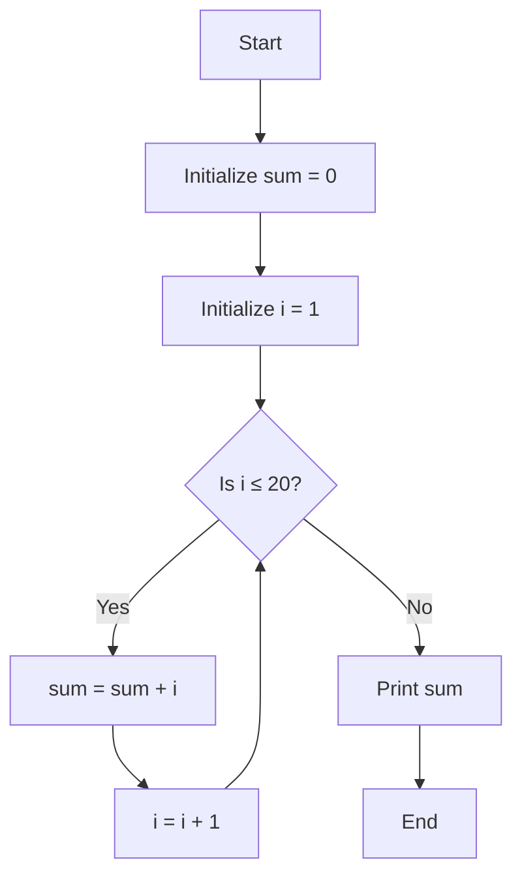
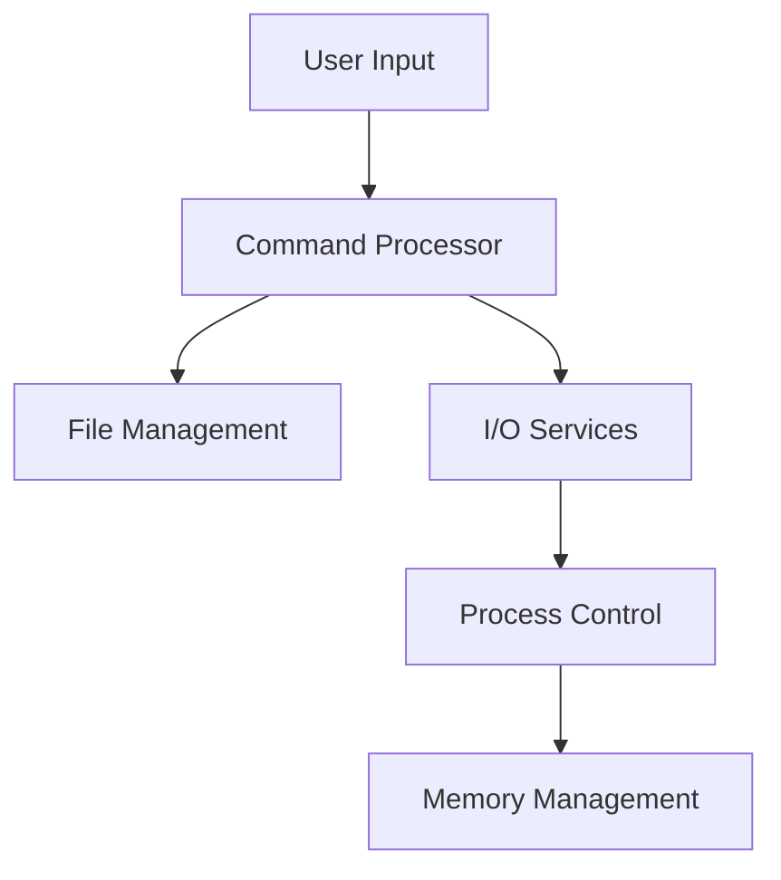
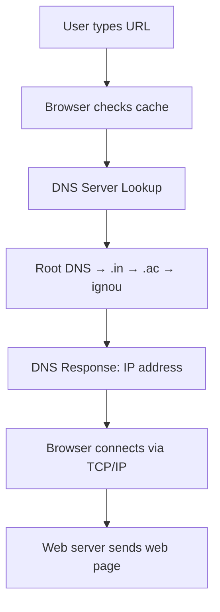
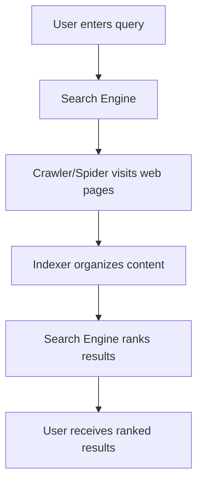
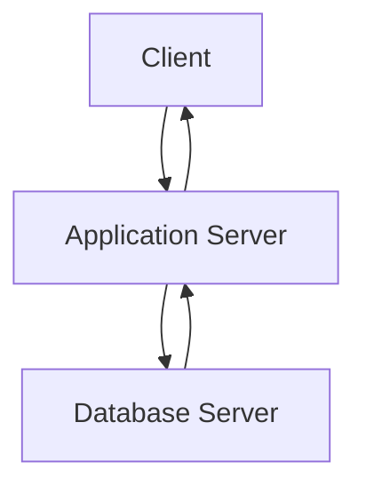

Here is your provided content, **formatted in Markdown** with:

* **LaTeX** used for mathematical expressions and conversions.
* **Mermaid.js** used for the flowchart.
* **Tables** rendered with proper alignment.

#### Prompt used 
```
i will provide the contents of a lm output 
 **format it in Markdown** with: 

* **LaTeX** used for mathematical expressions and conversions.
* **Mermaid.js** used for the flowchart.
* **Tables** rendered with proper alignment.
```

---

# BCS-011 - June 2024 Solutions

## **1. (a) Role of RAM in a Computer System**

### **Role of RAM:**

RAM (**Random Access Memory**) is a **read and write** (R/W) memory in a computer system. It is called *random access* because any location in memory can be accessed directly with equal speed. RAM is **volatile**, meaning its data is lost when power is turned off.

Key points:

* Stores programs and data required by the CPU.
* Acts as temporary memory during program execution.
* CPU **reads from** and **writes to** RAM.

### **Why RAM is needed even with a large hard disk:**

Even if a system has a large-capacity hard disk, RAM is essential because:

* Hard disks are **secondary storage** and cannot be accessed directly by the CPU.
* Data must be loaded into **main memory (RAM)** for CPU processing.
* RAM offers **faster access** (about 50–70 ns) compared to hard disks (measured in milliseconds).

> Without RAM, CPU operations would be **extremely slow** due to reliance on the hard disk for every instruction or data retrieval.

---

## **1. (b) I/O Devices for Specific Tasks**

### **(i) Moving Pointer and Selecting Information**

* **Device:** Mouse
* **Characteristics:**

  * Hand-held pointing device.
  * Detects motion on a surface to move cursor.
  * Includes buttons for selecting elements.
  * Comes in **mechanical, optical**, and **wireless** forms.

### **(ii) Input of Pictures**

* **Device:** Scanner / Digital Camera

**Scanner Characteristics:**

* Converts physical images or text into digital form.
* Types: Flatbed, Planetary, 3D scanners.

**Digital Camera Characteristics:**

* Captures still/video images digitally.
* Stores in memory cards.
* Supports direct connection to computers.
* Common formats: **JPEG**.

---

## **1. (c) Number System Conversions**

### **(i) Convert $(2.125)_{10}$ to Binary**

#### Integer Part:

$$
2 \div 2 = 1 \text{ remainder } 0 \\
1 \div 2 = 0 \text{ remainder } 1 \\
\Rightarrow \text{Binary: } 10
$$

#### Fractional Part:

$$
0.125 \times 2 = 0.250 \quad (\text{integer } 0) \\
0.250 \times 2 = 0.500 \quad (\text{integer } 0) \\
0.500 \times 2 = 1.000 \quad (\text{integer } 1) \\
\Rightarrow \text{Binary: } .001
$$

**Final Result:**

$$
(2.125)_{10} = (10.001)_2
$$

---

### **(ii) Convert $(11000011)_2$ to Hexadecimal and Decimal**

#### To Hexadecimal:

Group binary:

$$
1100\ 0011 = C3_{16}
$$

#### To Decimal:

$$
1 \times 2^7 + 1 \times 2^6 + 0 \times 2^5 + \ldots + 1 \times 2^0 = 128 + 64 + 2 + 1 = 195
$$

**Final Results:**

$$
(11000011)_2 = (C3)_{16} = (195)_{10}
$$

---

## **1. (d) Software for High-Level to Object Code Conversion**

* **Required Software:** **Compiler**

### **Characteristics of Compiler:**

* Translates **source code → object code** (machine-level).
* Performs **syntax checking** and reports **compile-time errors**.
* Faster execution since the entire program is pre-compiled.
* Not required during run-time.
* Examples: GCC, Turbo C++, Java Compiler (`javac`).

---

## **1. (e) Flowchart to Add Numbers 1 to 20**

### **Algorithm Steps:**

1. Start
2. Set `sum = 0`, `i = 1`
3. Repeat while $i \leq 20$:
   a. $\text{sum} = \text{sum} + i$
   b. $i = i + 1$
4. Print `sum`
5. End

### **Mermaid Flowchart:**



---

## **1. (f) Uses of DBMS and MS-Access Functions**

### **Uses of DBMS:**

* Organizes large datasets.
* Reduces data redundancy.
* Enables efficient **data entry, retrieval**, and **modification**.
* Applications:

  * University student records
  * Address books
  * Business directories

### **Functions of MS-Access:**

1. **Table Management:** Define fields, data types, primary keys.
2. **Relationships:** Link tables using common fields, enforce referential integrity.
3. **Queries:** Retrieve specific data, perform filters, joins, and calculations.

---

## **1. (g) Differences**

### **(i) Twisted Pair Cable vs Optical Fiber**

| Feature        | Twisted Pair Cable  | Optical Fiber                          |
| -------------- | ------------------- | -------------------------------------- |
| Structure      | Copper wire pairs   | Glass or plastic fibers                |
| Signal Type    | Electrical signals  | Light signals                          |
| Bandwidth      | Lower (\~100s Mbps) | Very high (Gbps and beyond)            |
| Attenuation    | High                | Low (up to 50 km without regeneration) |
| Interference   | Prone to EMI        | Immune to EMI                          |
| Cost           | Lower               | Higher                                 |
| Installation   | Easier              | Needs specialized skills               |
| Weight         | Heavier             | Lighter                                |
| Security       | Easier to tap       | Harder to tap                          |
| Directionality | Bidirectional       | Unidirectional                         |
| Usage          | LAN, telephone      | Long-distance telecom                  |

---

### **(ii) Radio Waves vs Microwaves**

| Feature          | Radio Waves              | Microwaves                      |
| ---------------- | ------------------------ | ------------------------------- |
| Frequency Range  | Lower (VHF, UHF, etc.)   | Higher (1–300 GHz)              |
| Propagation      | Omni-directional         | Line-of-sight                   |
| Antenna Type     | Non-directional          | Dish antennas (directional)     |
| Wall Penetration | Yes                      | No                              |
| Applications     | Mobile, Bluetooth, Radio | Satellite, Point-to-point links |
| Bandwidth        | Lower                    | Higher (100s of Mbps)           |
| Use Case         | Wide coverage            | Point-to-point, long-distance   |

---

### **(iii) Ring Topology vs Star Topology**

| Feature             | Ring Topology           | Star Topology                    |
| ------------------- | ----------------------- | -------------------------------- |
| Structure           | Circular loop           | All nodes connect to central hub |
| Data Flow           | Unidirectional          | Via hub                          |
| Reliability         | One failure affects all | More reliable; isolates faults   |
| Ease of Maintenance | Difficult               | Easy                             |
| Cabling Cost        | Moderate                | High (more cabling)              |
| Examples            | Token Ring, FDDI        | Ethernet LANs                    |

---

### **(iv) Collaboration vs Social Networking**

| Feature | Collaboration Networking  | Social Networking             |
| ------- | ------------------------- | ----------------------------- |
| Purpose | Work together on projects | Maintain personal connections |
| Focus   | Task and goal oriented    | Social interaction            |
| Tools   | Google Docs, wikis, BOINC | Facebook, Twitter, LinkedIn   |
| Content | Shared documents, code    | Photos, updates, chats        |
| Output  | Jointly created product   | Relationship and interaction  |
| Privacy | High; often restricted    | Varies; potentially public    |

---

### **3. (c) Explain different types of Operating Systems.**

Operating Systems (OS) can be classified into different types based on their structure, functionality, and mode of user interaction. Below are the main types of operating systems:

---

#### **1. Batch Operating System**

* **Definition**: Batch OS does not interact directly with the computer. Instead, users submit jobs (tasks) to the operator, who batches them and runs them without further user interaction.
* **Key Features**:

  * Jobs with similar needs are batched together and processed as a group.
  * No direct interaction with the user once the job is submitted.
  * Common in early mainframe systems.
* **Example**: IBM's early mainframe systems.
* **Advantage**: Efficient for processing large volumes of similar data.
* **Disadvantage**: No user interaction; debugging is difficult.

---

#### **2. Time-Sharing Operating System (Multitasking OS)**

* **Definition**: Allows multiple users or tasks to use the computer resources simultaneously by switching between them quickly.
* **Key Features**:

  * Each user is given a small time slice of CPU time.
  * Supports multitasking — running multiple programs at once.
* **Example**: UNIX, Linux, Windows 10.
* **Advantage**: Increases responsiveness and provides interactive use.
* **Disadvantage**: Requires complex scheduling algorithms.

---

#### **3. Distributed Operating System**

* **Definition**: Manages a group of independent computers and makes them appear to the users as a single computer.
* **Key Features**:

  * Computers are connected via a network.
  * Tasks are distributed among the systems for parallel processing.
* **Example**: LOCUS, Amoeba.
* **Advantage**: Resources like files and printers can be shared efficiently.
* **Disadvantage**: Complexity in communication and synchronization.

---

#### **4. Real-Time Operating System (RTOS)**

* **Definition**: Designed to serve real-time applications that process data as it comes in, often without any buffering delay.
* **Key Features**:

  * Used where time constraints are strict and delays can’t be tolerated.
  * Often used in embedded systems, robotics, and medical equipment.
* **Types**:

  * **Hard Real-Time OS**: Strict time constraints (e.g., pacemakers).
  * **Soft Real-Time OS**: Time constraints are important but not critical (e.g., video streaming).
* **Example**: VxWorks, RTLinux.
* **Advantage**: Highly responsive and reliable.
* **Disadvantage**: Limited multitasking ability and expensive to develop.

---

#### **5. Network Operating System (NOS)**

* **Definition**: An OS designed to manage and support networking functions like file sharing, printer access, and communication between connected systems.
* **Key Features**:

  * Manages network resources.
  * Allows users to access shared files and printers across the network.
* **Example**: Novell NetWare, Windows Server.
* **Advantage**: Centralized data management and enhanced security.
* **Disadvantage**: Requires a dedicated server and regular maintenance.

---

#### **6. Mobile Operating System**

* **Definition**: OS designed specifically for mobile devices like smartphones and tablets.
* **Key Features**:

  * Touch-based interface.
  * Optimized for battery efficiency and wireless communication.
* **Example**: Android, iOS.
* **Advantage**: Portable and designed for user-friendly mobile experiences.
* **Disadvantage**: Limited processing power compared to desktop OS.

---
Thanks for the detailed input! Here's your content reformatted in **Markdown** with:

* 📐 **LaTeX** used for mathematical expressions.
* 🔄 **Mermaid.js** used for the flowchart.
* 📊 **Tables** structured using proper Markdown alignment.

---

## **2. (a) What is a CPU in a Computer?**

### 🧠 What is a CPU?

The **Central Processing Unit (CPU)** is the *brain* of the computer. It executes instructions, performs calculations, and coordinates data flow in a system.

---

### 🧩 Components of a CPU

| Component                         | Description                                                    |
| --------------------------------- | -------------------------------------------------------------- |
| **ALU** (Arithmetic & Logic Unit) | Performs arithmetic and logic operations.                      |
| **CU** (Control Unit)             | Directs operations of the processor and controls input/output. |
| **Registers**                     | High-speed storage for temporary data.                         |

---

### 🔧 Roles of CPU Components

1. **Arithmetic & Logic Unit (ALU)**

   * Executes arithmetic operations: $+, -, \times, \div$
   * Performs logical operations: comparisons (>, <, ==)
   * Interacts with memory to process and return data.

2. **Control Unit (CU)**

   * Supervises instruction execution order.
   * Interprets program instructions.
   * Coordinates I/O and timing signals.

3. **Registers**

   * Temporary, fast-access storage.
   * Two types:

     * **User-visible registers**: store temporary data.
     * **Control & status registers**: manage CPU operations.

---

## **2. (b) Storage Capacity of a Disk Pack**

### Given:

* Plates = 8
* Tracks per surface: $t = 2048$
* Sectors per track: $p = 512$
* Sector size: $s = 1 \text{ KB} = 1024 \text{ bytes}$

### Number of surfaces:

$$
m = 8 \times 2 = 16
$$

### Formula:

$$
\text{Storage Capacity} = m \times t \times p \times s
$$

### Calculation:

$$
= 16 \times 2048 \times 512 \times 1024 = 17,\!179,\!869,\!184 \text{ bytes}
$$

### Conversion to GB:

$$
\frac{17,\!179,\!869,\!184}{1024^3} = 16 \text{ GB}
$$

✅ **Answer:** **16 GB**

---

## **2. (c) Access Time in Hard Disk**

### Formula:

$$
\text{Access Time} = \text{Seek Time (}T_s\text{)} + \text{Latency Time (}t_L\text{)}
$$

| Component        | Description                                     |
| ---------------- | ----------------------------------------------- |
| **Seek Time**    | Time to position the head on the correct track. |
| **Latency Time** | Wait time for sector to rotate under the head.  |

### Example:

* Seek time: $T_s = 8 \text{ ms}$
* Latency time: $t_L = 4 \text{ ms}$
* Access time:

$$
T = 8 + 4 = \boxed{12 \text{ milliseconds}}
$$

---

## **2. (d) Utility Software of a Computer**

| Utility               | Description                                             |
| --------------------- | ------------------------------------------------------- |
| **Disk Checker**      | Checks and repairs file system errors (e.g., `CHKDSK`). |
| **System Restore**    | Restores system files/settings to an earlier point.     |
| **Disk Defragmenter** | Reorganizes fragmented data to improve performance.     |

---

## **3. (a) What is an Operating System?**

An **Operating System (OS)** is a software that:

* Interfaces between user and hardware.
* Manages resources like memory, I/O devices, files, and processes.

---

### 🛠️ Services Offered by OS



| Service                | Description                               |
| ---------------------- | ----------------------------------------- |
| **Command Processor**  | Accepts user commands (GUI/CLI).          |
| **File Management**    | Organizes, stores, and retrieves files.   |
| **I/O Services**       | Manages I/O devices with drivers.         |
| **Process Management** | Handles process scheduling and control.   |
| **Memory Management**  | Allocates/deallocates memory dynamically. |

---

## **3. (b) Programming Concepts with Examples**

### (i) Data Types

```c
int age;
float price;
char initial;
char name[10];
```

| Type    | Meaning   | Example            |
| ------- | --------- | ------------------ |
| `int`   | Integer   | `int x = 5;`       |
| `float` | Decimal   | `float pi = 3.14;` |
| `char`  | Character | `char ch = 'A';`   |

---

### (ii) One-Dimensional Array

```c
int marks[5] = {85, 92, 78, 65, 90};
printf("%d", marks[2]);  // prints 78
```

* Simplifies storage of multiple values of the same type.

---

### (iii) Subroutines

```c
void greetUser(char name[]) {
    printf("Hello, %s!\n", name);
}
```

* Called using `greetUser("Alice");`
* Improves reusability and structure.

---

### (iv) Expression

```c
int a = 10, b = 5, c;
c = a + b * 2; // c = 20
```

* Arithmetic: `a + b`
* Relational: `a > b`
* Logical: `(a == 10) && (b != 0)`

---

### (v) Library Function

```c
#include <stdio.h>
#include <math.h>

scanf("%d", &num);       // Input
printf("Hello\n");       // Output
result = sqrt(num);      // Math function
```

* Built-in, ready-to-use functions.

---

Thanks! Here's your entire content reformatted into **structured Markdown** with:

* ✅ **LaTeX formatting** for technical terms and formulas where applicable.
* 📊 **Tables** and clear bullet formatting.
* 🌐 **Mermaid diagrams** for flow-based explanations.
* 📦 Clean Markdown that is suitable for notes, documentation, or HTML export.

---

## **4 (a) Role of Networking Devices**

Networking devices connect and manage communication between systems in a network.

### **(i) Bridges**

* **Role:** Connect two LAN segments and forward data frames at the data link layer (Layer 2 of OSI).
* **Functionality:**

  * Filter traffic by MAC address.
  * Reduce network congestion.
  * Divide large networks to isolate traffic problems.

---

### **(ii) Switches**

* **Role:** Directly send data to the intended recipient device within a LAN.
* **Functionality:**

  * Learn MAC addresses of devices connected to each port.
  * Reduce unnecessary traffic by forwarding frames only to the destination port.
  * Improve security and network performance.

---

### **(iii) Modem**

* **Role:** Converts digital signals to analog (modulation) and vice versa (demodulation) for communication over telephone lines.
* **Functionality:**

  * **Modulation:** Digital → Analog
  * **Demodulation:** Analog → Digital
* **Types:** Internal and external modems.
* **Use Case:** Dial-up internet access.

---

### **(iv) Router**

* **Role:** Connects different networks and forwards packets based on IP addresses.
* **Functionality:**

  * Uses routing tables to determine optimal paths.
  * Supports multiple protocols (TCP/IP).
  * Connects LAN to WAN (e.g., the Internet).
  * Performs packet switching and load balancing.

---

## **4 (b) What is an IP Address? How a URL is Translated to an IP Address**

### **What is an IP Address?**

An **IP address** is a unique identifier for a device on a network. It comes in two versions:

* **IPv4:** 32-bit address (e.g., `192.168.1.1`)
* **IPv6:** 128-bit address (e.g., `2001:0db8:85a3::8a2e:0370:7334`)

---

### **How a URL is Translated to an IP Address**

**Step-by-step Example:** Visiting `http://www.ignou.ac.in`

1. **User types the URL** in the browser.
2. **Browser checks cache** for stored DNS records.
3. If not found, **DNS query** is sent to local DNS server.
4. **DNS server hierarchy** resolves domain:

   * Root → `.in` → `.ac.in` → `ignou`
5. **DNS returns IP address** (e.g., `190.10.10.247`)
6. **Browser connects via TCP/IP** to IP.
7. **Web server responds with page content.**



---

## **4 (c) What is a Browser? Precautions for Safe Browsing**

### **What is a Browser?**

A **web browser** is software that allows users to access and view content on the World Wide Web. It renders HTML pages and supports various media types.

**Examples:** Chrome, Firefox, Safari, Edge, Opera

---

### **5 Precautions for Safe Browsing**

| # | Precaution                                                                     |
| - | ------------------------------------------------------------------------------ |
| 1 | **Avoid suspicious links** — Don't click unknown or unsolicited URLs.          |
| 2 | **Keep browser updated** — Always install the latest security patches.         |
| 3 | **Check for HTTPS** — Ensure secure connections before entering personal data. |
| 4 | **Avoid unknown plugins** — Don't install extensions from untrusted sources.   |
| 5 | **Clear data on public devices** — Always log out and clear cache/history.     |

---

## **5. Explain Any Five:**

---

### **(a) Search Engines**

A **search engine** helps users locate information online using keywords.

**Working Phases:**



* **Crawling:** Automated bots scan and collect content.
* **Indexing:** Data is structured for fast searching.
* **Searching:** Queries are matched against the index.

**Boolean Example:**

* `"Java AND Tutorial"` → Finds pages with both terms.
* `"Tutorials NOT Java"` → Excludes Java-related results.

---

### **(b) Open Source Software**

**Definition:** Software with **freely available source code**, allowing users to use, modify, and distribute it.

**Key Traits:**

* Free redistribution
* Source code availability
* Allowance for derivative works
* No discrimination
* Not product-tied

**Examples:** Linux, Firefox, MySQL, VLC, Apache

---

### **(c) Client-Server Architecture**

**Definition:** A model where **clients request services** and **servers provide them**.

**Three-Tier Architecture:**



* **Client Tier:** User interface (e.g., browser)
* **Application Tier:** Business logic (e.g., Java, Python)
* **Database Tier:** Stores data (e.g., MySQL)

**Example:** E-commerce site or online banking.

---

### **(d) Integrated Circuits (ICs)**

**Definition:** A miniaturized electronic circuit on a semiconductor chip.

**Features:**

* High density of transistors (millions)
* Small size, low cost
* Foundation for CPUs and memory chips

**Example Diagram:**

```
   +-----------------------+
   |  IC Circuitry Inside  |
   |  (millions of gates)  |
   +-----------------------+
   ||||||||||||||||||||||||  <- Connector Pins
```

**Use Cases:** Microprocessors, memory, smartphones, embedded systems.

---

### **(e) Printing Technologies**

**Classified by impact:**

| Type           | Examples                | Features                                   |
| -------------- | ----------------------- | ------------------------------------------ |
| **Impact**     | Dot-matrix, Daisy-wheel | Noisy, low resolution, carbon copy capable |
| **Non-impact** | Inkjet, Laser           | Quiet, high quality, color capable         |

* **Dot-matrix:** Uses pins and ribbon; cheap but noisy.
* **Inkjet:** Sprays ink; better quality, slower.
* **Laser:** Uses toner and laser beam; fast and high-quality.

---
