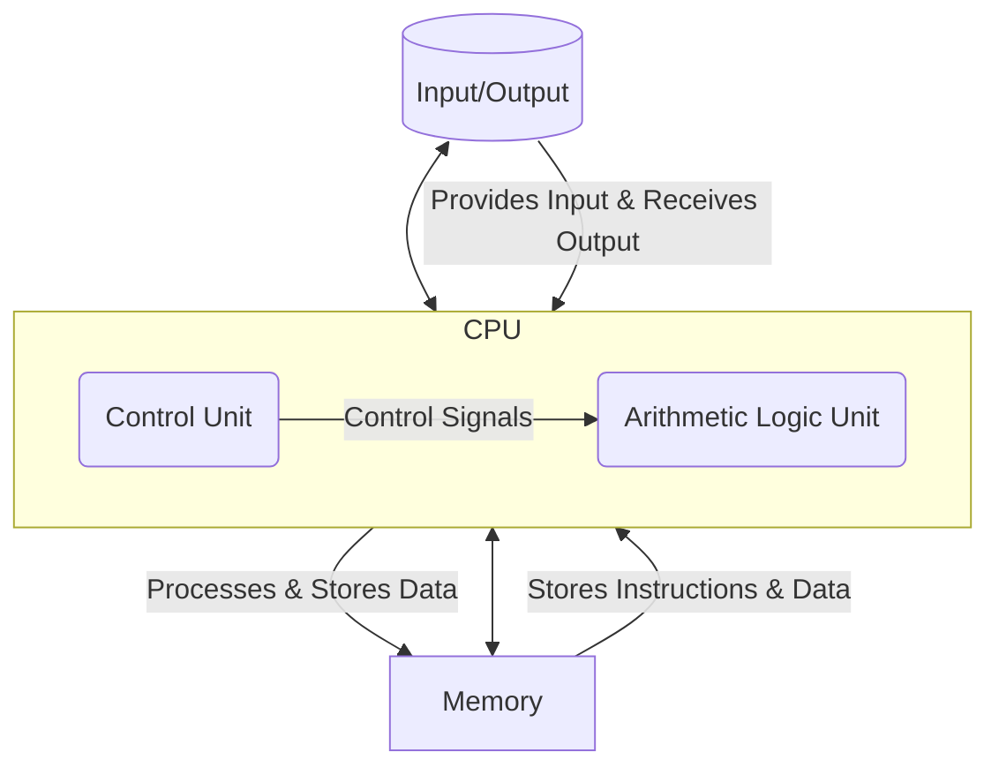

Here's your content properly formatted in **Markdown**, with a correctly embedded **Mermaid.js diagram** for the Von Neumann Architecture:

---

# Von Neumann Architecture

The **Von Neumann Architecture** is a foundational computer architecture conceived by mathematician **John Von Neumann**, and it forms the core of nearly every computer system in use today. This design model for modern computers is characterized by a **Central Processing Unit (CPU)** and a **single memory unit** used for storing both data and instructions.

This crucial principle is known as the **stored program concept**, where the program's instructions and the data it operates on are held together in the same memory space.

---

## Basic Components of Von Neumann Architecture

All computers adhering to the Von Neumann architecture share the following basic components:

### • Central Processing Unit (CPU)

Often referred to as the *"brain"* of the computer, the CPU is responsible for executing instructions and performing calculations. It typically comprises two main parts:

* **Arithmetic Logic Unit (ALU):**
  Performs all arithmetic operations (like addition, subtraction, multiplication, and division) and logical decisions (such as comparisons).

* **Control Unit (CU):**
  Interprets instructions, generates micro-operations, and coordinates the overall execution of tasks by directing other components of the computer system, including the ALU and memory.

### • Memory

Serves as a temporary storage space that holds both the program's instructions and the data that the CPU needs to process. It acts as a "loading dock" for data before it is processed by the CPU, providing fast access compared to secondary storage.

### • Input/Output (I/O) System

Provides the means for the computer to interact with the external world—accepting data and commands from input devices and presenting results through output devices.

---

## Operational Overview

The architecture enables the CPU to:

* Fetch instructions and data from memory
* Process the data
* Store the results back into memory or send them to an output device

---

## Diagram: Von Neumann Architecture

---

Let me know if you'd like a downloadable version or need it converted to another format (PDF, HTML, etc.).
